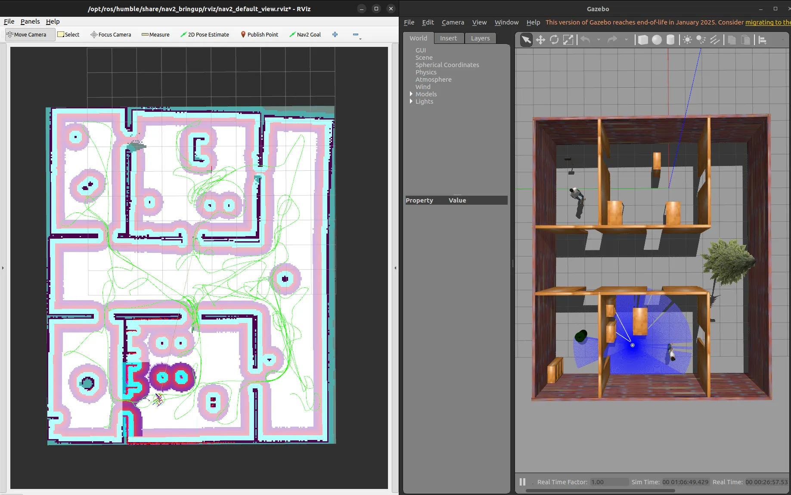
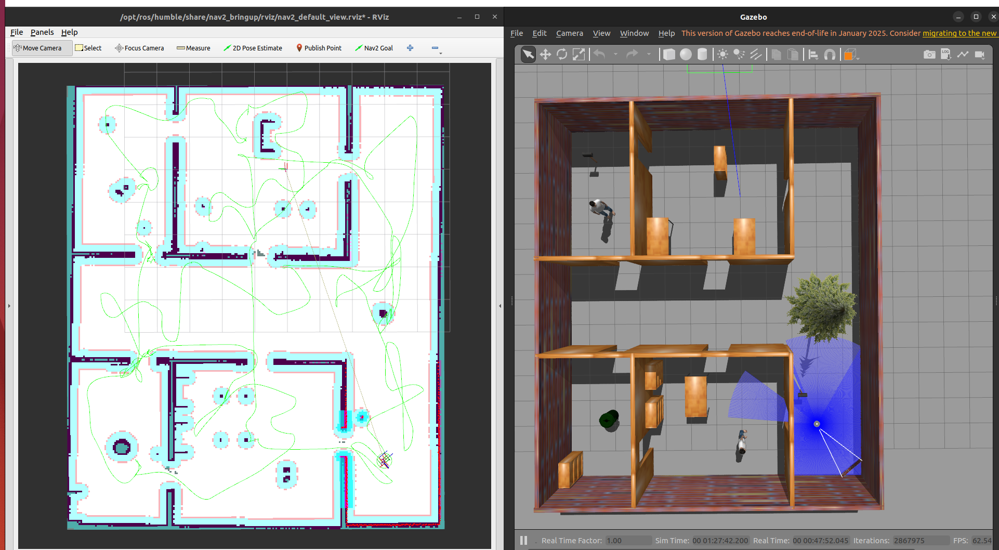

# Autonomous Exploration

## Description

This package provides an autonomous exploration algorithm designed for robots to explore unknown environments. Built on ROS 2 Humble, it works in collaboration with SLAM (Simultaneous Localization and Mapping) algorithms to receive real-time map data, identify frontiers (boundaries between known and unknown areas), and autonomously assign goal poses at these frontiers to guide the robot's exploration strategy.

## Demo


## Build and Execute

### Building the Package

1. Create a workspace directory and clone this repository:
```bash
mkdir -p ~/ros2_ws/src

cd ~/ros2_ws/src

git clone https://github.com/austinchao886/nav2_autonomous_exploration.git
```

2. Build the workspace:
```bash
cd ~/ros2_ws

colcon build

source install/setup.bash
```

### Testing with Gazebo Simulation

You can test this algorithm using the ROS 2 Gazebo system with TurtleBot3.

1. **Clone TurtleBot3 Gazebo** (if not already installed):
```bash
cd ~/ros2_ws/src

git clone -b humble https://github.com/ROBOTIS-GIT/turtlebot3_simulations.git
```

2. **Create a custom world launch file** `diff_car_world.launch.py` and modify the world path:
```python
world = os.path.join(
    get_package_share_directory('turtlebot3_gazebo'),
    'worlds',
    'my_world.world'
)
```
The `my_world.world` file is the testing world located in the `/maps` directory. This will spawn the robot and the world in the Gazebo simulation.

3. **Launch the Gazebo simulation**:
```bash
ros2 launch turtlebot3_gazebo diff_car_world.launch.py
```

4. **Start the Navigation2 stack**:
```bash
ros2 launch turtlebot3_navigation2 navigation2.launch.py use_sim_time:=True
```

5. **Launch the SLAM algorithm**:
```bash
ros2 launch slam_toolbox online_async_launch.py
```

6. **Run the autonomous exploration algorithm**:
```bash
ros2 run custom_explorer explorer_cost_function
```

## Algorithm Development and Improvements

This section describes the strategy developed for selecting frontier points during autonomous exploration.

### Initial Approach: Naive Method

Initially, a naive method was implemented to select goal points. This approach:
- Used only the occupancy map to obtain map information
- Identified frontier cells as those with unknown (-1) values adjacent to known cells
- Selected the nearest frontier cell as the goal point

### Improved Strategy

The algorithm was enhanced with the following improvements:
- **Frontier Clustering**: Grouped frontier points into meaningful clusters
- **Frontier Filtering**: Applied filters to eliminate unsuitable frontier candidates
- **Goal Selection Fine-tuning**: Optimized the strategy for selecting the most efficient goal points

### Performance Comparison

The improvements resulted in significantly more efficient exploration, as demonstrated by the reduction in total exploration distance.

| Method | Total Exploration Distance | Improvement |
|--------|---------------------------|-------------|
| Before (Naive Method) | 241.68 | Baseline |
| After (Improved Strategy) | 182.26 | ↓ 25% |

**Before (Naive Method):**



**After (Improved Strategy):**



The results clearly show that the robot explores more efficiently with the improved algorithm, covering the same area with reduced travel distance.
